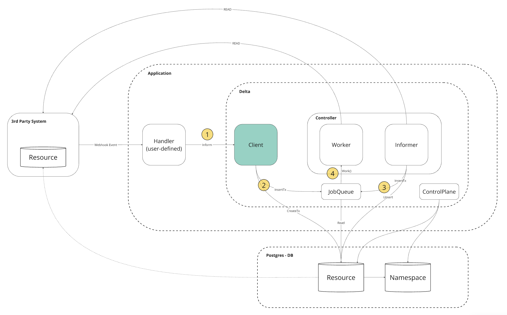

# delta

Delta is a robust high-performance resource synchronization system for Go and Postgres.

## Overview

In robotics and automation, a control loop is a non-terminating loop that regulates the state of a system.

In Delta, controllers are control loops that watch the state of your database resources,
check for state changes externally, and then make or request changes where needed.
Each controller tries to move the current database state closer to the desired state.

### Controller Pattern

A controller tracks exactly one Delta resource type.
These objects are defined as structs that implement the `Object` interface.
The controller(s) for that resource are responsible for making the current state come closer to that desired state.

### Desired versus current state

Your database or external systems could be changing at any point as work happens
and control loops automatically fix failures and discrepancies.
This means that, potentially, your database never reaches a stable state.

As long as the controllers for your database are running and able to make useful changes,
it doesn't matter if the overall state is stable or not.

## Resources

Resources are defined via an struct that implements the `Object` interface:

```go
type User struct {
    Email string
    Name  string
    UpdatedAt int64
}

func (u *User) ID() string {
    // The Email uniquely identifies the user on the external system.
    return e.Email
}

func (u *User) Kind() string {
    return "user"
}

func (u *User) Compare(other delta.Object) (int, bool) {
    user, ok := other.(User)
    if !ok {
        return 0, false
    }
    if u.Email != user.Email {
        return 0, false
    }
    return u.UpdatedAt - user.UpdatedAt, true
}
```

## Controller

Controllers are defined via a struct that implement the `Worker` and `Informer` interfaces:

```go
type UserController struct {
    // An embedded WorkerDefaults sets up default methods to fulfill the rest of
    // the Worker interface:
    delta.WorkerDefaults[User]
    // An embedded StreamDefaults sets up default methods to fulfill the rest of
    // the Stream interface:
    delta.InformerDefaults[User]
}

// Work does the heavy lifting of processing a resource.
func (c *UserController) Work(ctx context.Context, resource *delta.Resource[User]) error {
    fmt.Printf("Worked user: %+v\n", resource.Object.Email)
    return nil
}

// Inform pushes resources into a channel for processing.
func (c *UserController) Inform(ctx context.Context, opts *delta.InformOptions) (<-chan User, error) {
    userChan := make(chan User)
    resp, _ := http.DefaultClient.Get("https://api.example.com/users", nil)
    defer resp.Body.Close()

    var users []User
    if err := json.NewDecoder(resp.Body).Decode(&users); err != nil {
        return err
    }

    go func() {
        defer close(userChan)
        for _, user := range users {
            if !c.Match(&user) {
                continue
            }
            select {
            case <-ctx.Done():
                return ctx.Err()
            case userChan <- user:
            }
        }
    }()

    return userChan, nil
}
```

### Registering controllers

Resources are uniquely identified by their `kind` string. Controllers are registered on
start up so that Delta knows how to assign resources to controllers:

```go
controllers := delta.NewControllers()
// AddWorker panics if the controller is already registered or invalid:
delta.AddController(controllers, &UserController{})
```

## Informing resources

[`Client.InformTx`] is used in conjunction with an instance implementation
of `Resource` to inform a Delta Controller about a resource object:

```go
_, err = deltaClient.InformTx(ctx, tx, User{
    Email: "bob@hello.com",
    Name:  "Bob",
    UpdatedAt: time.Now().Unix(),
}, nil)

if err != nil {
    panic(err)
}
```

## Starting a client

A Delta [`Client`] provides an interface for resource synchronization and background job
processing. A client's created with a database pool and config struct
containing a `Controllers` bundle and other settings.
Here's a client `Client` working one namespace (`"default"`) with up to 10 controller
goroutines at a time:

```go
deltaClient, err := delta.NewClient(dbPool, &delta.Config{
    Namespaces: map[string]delta.NamespaceConfig{
        delta.NamespaceDefault: {MaxWorkers: 10},
    },
    Controllers: controllers,
})
if err != nil {
    panic(err)
}

// Run the client inline. All executed processes will inherit from ctx:
if err := deltaClient.Start(ctx); err != nil {
    panic(err)
}
```

## Stopping

The client should also be stopped on program shutdown:

```go
// Stop fetching new work and wait for active jobs to finish.
if err := deltaClient.Stop(ctx); err != nil {
    panic(err)
}
```

There are some complexities around ensuring clients stop cleanly, but also in a
timely manner.

## Control Plane Components

The control plane's components make global decisions about how Delta manages resources
(for example, scheduling and executing jobs) as well as detecting and responding to events.

### postgres

Persisted state is stored in a [Postgres](https://www.postgresql.org/docs/) database.

### river

Control plane component that manages, queues, and schedules execution of background jobs.
River relies on Postgres to store job and queue state, and also embeds a leader election mechanism
to manage periodic maintenance of Delta's control plane.

You can learn more about River in the [official documentation](https://riverqueue.com/docs).

## Architecture

The Delta architecture is designed to be modular and extensible.
Below you will a high-level diagram of the Delta architecture
and how an application interacts with the Delta system.



## Acknowledgements

This project uses the following dependencies:

- [River](https://github.com/riverqueue/river), which is licensed under the Mozilla Public License 2.0 (MPL-2.0).
- [pgx](https://github.com/jackc/pgx), which is licensed under the MIT License.
